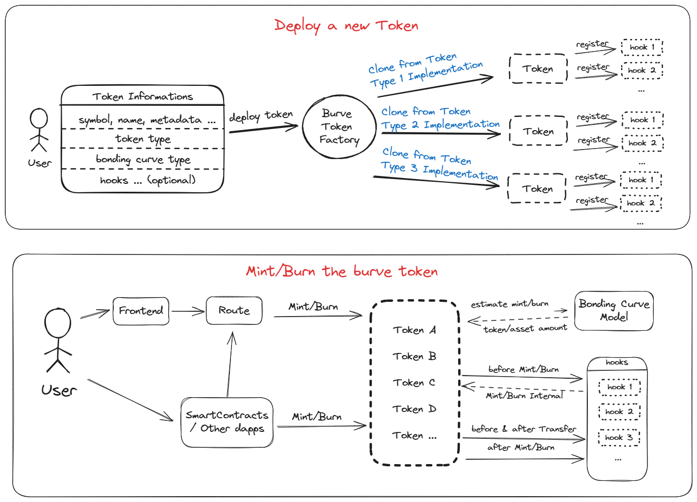

[Website](https://burve.io/) | [X](https://x.com/BurveProtocol) | [WhitePaper](https://burve.io/papers/Whitepaper_BurveLabs.pdf)

### Description
😈Burve Protocol

the DeFi3.0 Protocol: A Consensus-Driven AMM for Token Fair Launch and Unilateral Liquidity Management.

### Architecture


### How to build
```
git clone https://github.com/BurveProtocol/burve-contracts.git
git checkout v1.2
git submodule update --init --recursive
forge build
```

### Testing
```
forge test
```
or 
```
forge coverage
```


### Files description

```
burve-contracts
├─ script //the script of deployment 
├─ src 
│  ├─ BurveTokenFactory.sol // the preset will be cloned inside the factory
│  ├─ abstract
│  │  ├─ BurveBase.sol  //the basic bonding curve logic
│  ├─ bondingCurve //the bonding curve model
│  ├─ hooks //some optional hooks can inject when the Burve token is minting, burning or transferring
│  ├─ interfaces 
│  ├─ preset //the extended preset base on BurveBase
│  │  ├─ BurveERC20Mixed.sol //default Burve ERC20 implement, with infinite supply
│  │  ├─ BurveERC20WithSupply.sol //the extension of BurveERC20Mixed, with specific supply
│  │  ├─ BurveLOL.sol //basic LOL implement, extended from BurveERC20WithSupply
│  │  ├─ BurveLOLBase.sol //the Base Chain implement of LOL
│  │  └─ BurveLOLBsc.sol //the BNB Chain implement of LOL
├─ test //unit test

```

### Technical documents
```
forge doc -s -p <port>
```

### How to integrate
```
 forge install github.com/burveprotocol/burve-contracts
```

``` javascript 

//the metadata fields
const metadataObj: {
name: 'name',
image: 'imagaUrl',
description: 'description',
website_url: 'website_url',
twitter_url: 'twitter_url',
discord_url: 'discord_url',
telegram_url: 'telegram_url',
};
//upload the metadata to ipfs
```


``` solidity

import "burve-contracts/src/interfaces/IBurveFactory.sol";
import "burve-contracts/src/interfaces/IBurveToken.sol";


contract BurveIntegrate{
    IBurveToken currentToken;
    //deploy a new token
    function deployToken() external {
        address projectAdmin=address(0x1);
        address projectTreasury=address(0x2);
        uint256 mintTax=100; //1%
        uint256 burnTax=150; //1.5%
        address raisingTokenAddr=address(0);//if the raisingTokenAddr is address(0), that means the raising token will be the Native Token like ETH,BNB
        uint256 a = 0.001 ether;
        uint256 A = 1000;
        uint256 b = ((A * 1e18) / a) * 1e18;
        uint256 totalSupply = 21000000 ether;
        bytes memory data = abi.encode(a, b); 
        bytes memory newData = abi.encode(totalSupply, data);//this will be used if the tokenType is `ERC20WithSupply` or `LOL`
        IBurveFactory.TokenInfo memory info = IBurveFactory.TokenInfo({
            tokenType: "ERC20", // also can be `ERC20WithSupply` or `LOL`.
            bondingCurveType: "exponential",// or `linear`. if use linear, the parameter should be `abi.encode(k,p)`
            name: "Burve ERC20 Token",
            symbol: "BET",
            metadata: "ipfs://{cid}",//the 
            projectAdmin: projectAdmin,
            projectTreasury: projectTreasury,
            projectMintTax: mintTax,
            projectBurnTax: burnTax,
            raisingTokenAddr: address(0),
            data: data //use `newData` instead, if the tokenType is `ERC20WithSupply` or `LOL`
        });
        // if you are not going to use any hooks, you can use `deployToken` or let the lengths of `hooks` and `datas` to 0.
        address[] memory hooks = new address[](1);
        bytes[] memory datas = new bytes[](1);
        hooks[0] = address(0x3);//the address of hook, you can find it from our graph api. https://github.com/BurveProtocol/burve-graph.git
        datas[0] = abi.encode(block.timestamp+1 days); //check the `parameterEncoder` of the hook, there should be different between all the hooks.
        currentToken = IBurveToken(factory.deployTokenWithHooks(info, 0, hooks, datas));
    }

    function mintAndBurn() external {

        //deposit exact raising token to mint burve token
        uint256 payAmount = 1 ether;
        address receiver = address(0x5);
        (uint256 tokenAmount, , , ) = currentToken.estimateMint(payAmount);
        address raisingToken = currentToken.getRaisingToken();
        if (raisingToken != address(0)) {
            IERC20(raisingToken).approve(currentToken, payAmount);
        }
        currentToken.mint{value: raisingToken == address(0) ? payAmount : 0}(receiver, payAmount, tokenAmount);

        //deposit raising token to mint exact burve token
        uint256 tokenWant = 10000 ether;
        (, payAmount, , ) = currentToken.estimateMintNeed(tokenWant); // estimate mint 10000 ether token need pay how many raisingToken
        address raisingToken = currentToken.getRaisingToken();
        if (raisingToken != address(0)) {
            IERC20(raisingToken).approve(currentToken, payAmount);
        }
        currentToken.mint{value: raisingToken == address(0) ? payAmount : 0}(receiver, payAmount, tokenWant);

        //burn exact burve token to refund raising token
        uint256 tokenToBurn
        (, uint256 raisingTokenAmount, , ) = currentToken.estimateBurn(tokenToBurn);
        currentToken.burn(receiver, tokenToBurn, raisingTokenAmount);
    }

}


```